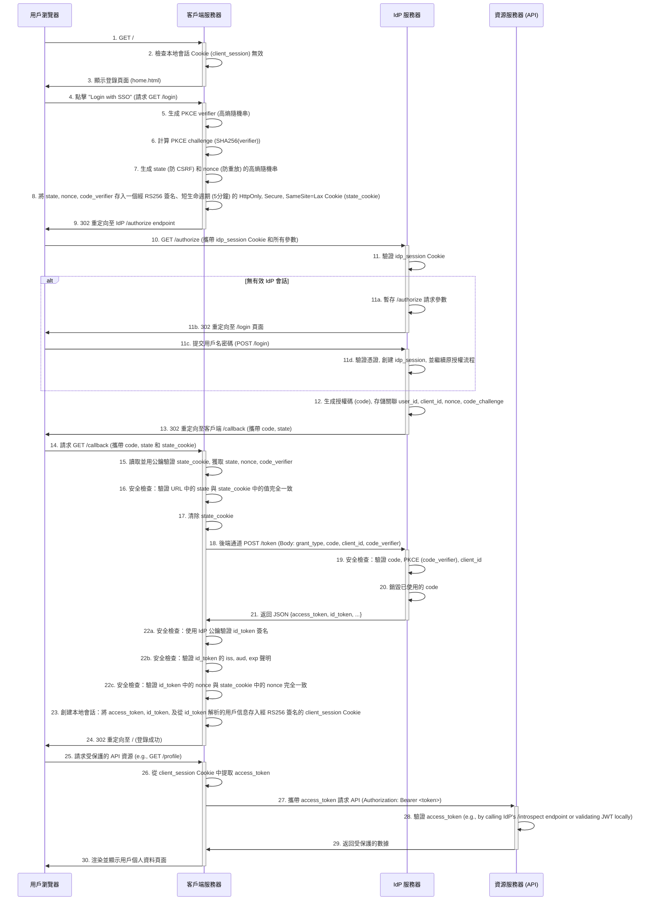
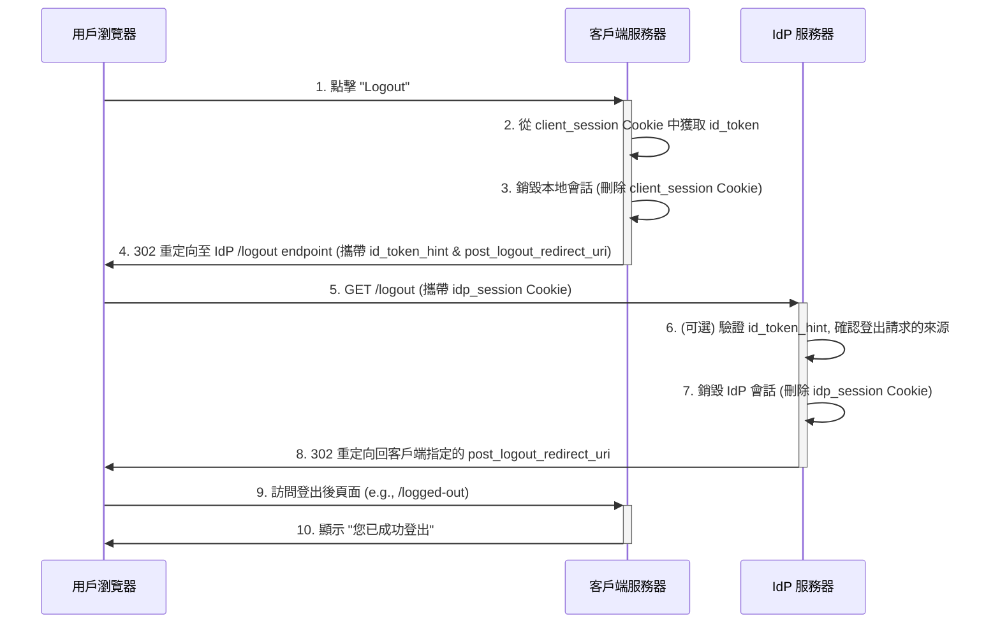

# SSO 項目開發與實施計劃

## 項目總覽

本計劃旨在通過一個迭代式的三階段開發流程，從零開始構建一個功能完整、安全且可觀測的單點登錄 (SSO) 解決方案。開發將遵循 OIDC (OpenID Connect) 標準，並採用授權碼流程 (Authorization Code Flow)。

開發階段規劃如下：
1. 第一階段：最小可行產品 (MVP)。目標是快速搭建一個功能性的原型，驗證核心流程的連通性，此階段不考慮安全性。
2. 第二階段：最佳實踐與安全強化。在原型基礎上，重構並實現所有必要的安全機制，使其達到生產環境的安全標準。
3. 第三階段：監控與可觀測性。為系統增加詳細的日誌記錄與監控能力，確保系統的穩定性與可維護性。

## 使用的函式庫規劃

為確保技術棧的統一與高效，我們將使用以下 Python 函式庫：

- 通用函式庫 (所有服務共用):
  - fastapi: 用於構建所有服務 (IdP, Client) 的 API 端點。
  - uvicorn: 作為 ASGI 伺服器，運行 FastAPI 應用。
  - python-multipart: 用於處理表單數據提交 (例如登錄表單)。

- IdP (身份提供者) 特定函式庫:
  - python-jose[cryptography]: 用於創建、簽名和管理 JWT (id_token) 及 JWK (JSON Web Key)。
  - jinja2: 用於從後端渲染 HTML 登錄頁面。

- Client (客戶端應用) 特定函式庫:
  - requests: 用於在後端通道向 IdP 的 /token 端點發起 HTTP 請求。
  - jinja2: 用於渲染客戶端的前端頁面。

## 第一階段：最小可行 SSO (Minimum Viable Product)

目標：搭建一個最簡化的 OIDC 流程骨架，確保 IdP 和 Client 之間的重定向與基本通信能夠跑通。此階段的產出為一個功能原型，不具備安全性。

IdP 任務：
1. 創建一個內存中的用戶數據庫 (例如一個 Python 字典) 用於模擬用戶數據。
2. 實現 GET /login 端點，用於顯示一個基礎的 HTML 登錄頁面。
3. 實現 POST /login 端點，用於驗證用戶憑證，成功後在瀏覽器中設置一個簡單的、未加密的會話 Cookie。
4. 實現 GET /authorize 端點，該端點僅檢查會話 Cookie 是否存在，然後直接生成一個固定的、無意義的授權碼 (code)，並重定向回客戶端的 /callback。
5. 實現 POST /token 端點，該端點僅接收授權碼，然後返回一個固定的、未簽名的 id_token。

Client 任務：
1. 創建一個主頁，包含一個「Login with SSO」的鏈接。
2. 實現 GET /login 端點，該端點直接重定向到 IdP 的 /authorize 端點，並攜帶 client_id 和 redirect_uri。
3. 實現 GET /callback 端點，該端點從 URL 中獲取授權碼，然後向 IdP 的 /token 端點發起請求，接收固定的 id_token。
4. 成功獲取 id_token 後，設置一個簡單的本地會話 Cookie，並重定向到一個顯示「登錄成功」的受保護頁面。

產出：
- 一個可以完成重定向登錄流程，但沒有任何安全措施的 SSO 系統。
- 所有服務 (IdP, Client1, Client2) 的基礎 FastAPI 應用結構。

風險提示：此階段的產出存在所有已知的 OIDC 安全漏洞，嚴禁在任何非本地開發環境中使用。

## 第二階段：最佳實踐與安全強化

目標：在第一階段的基礎上，全面重構系統，實現所有必要的 OIDC 安全機制，使其達到生產級別的安全標準。

IdP 任務：
1. 實現 PKCE 驗證：在 /authorize 端點存儲 code_challenge，並在 /token 端點驗證客戶端傳來的 code_verifier。
2. 實現 state 參數透傳：在 /authorize 端點接收 state，並在重定向回 /callback 時原樣返回。
3. 實現 nonce 處理：在 /authorize 端點接收 nonce，並將其包含在生成的 id_token 的聲明中。
4. 實現標準的 JWT (id_token) 生成：
   - 使用 RS256 算法和密鑰對 (公鑰/私鑰) 進行簽名。
   - 包含所有必要的聲明 (iss, sub, aud, exp, iat, nonce)。
5. 實現 JWKS 端點：創建一個 /.well-known/jwks.json 端點，用於發布簽名 id_token 所使用的公鑰。
6. 實現標準的登出端點 (RP-Initiated Logout)，用於清除 IdP 會話。
7. 強化會話 Cookie：使用簽名的 JWT 作為會話內容，並設置 HttpOnly, Secure, SameSite=Lax 屬性。

Client 任務：
1. 實現 PKCE 流程：在發起 /authorize 請求前，生成 code_verifier 和 code_challenge。
2. 實現 state 參數生成與驗證：在發起請求前生成隨機 state，並在 /callback 端點驗證其一致性。
3. 實現 nonce 參數生成與驗證：在發起請求前生成隨機 nonce，並在驗證 id_token 時校驗其一致性。
4. 實現標準的 id_token 驗證：
   - 從 IdP 的 JWKS 端點獲取公鑰。
   - 驗證 id_token 的簽名。
   - 驗證 iss, aud, exp, iat, nonce 等所有關鍵聲明。
5. 實現標準的登出流程，調用 IdP 的登出端點。
6. 強化本地會話 Cookie 的安全性：使用 RS256 算法和獨立的密鑰對為客戶端自身的會話 Cookie 簽名，確保與 IdP 的 `id_token` 簽名機制保持一致的安全標準。

產出：
- 一個符合 OIDC 核心規範、能夠抵禦常見攻擊 (如 CSRF, Replay, Code Interception) 的安全 SSO 系統。

## 第三階段：監控與可觀測性

目標：為系統增加詳細的監控指標與結構化日誌，實現生產級別的可觀測性，支持與 Prometheus、Grafana、Loki 等外部監控平台無縫對接。

**重要說明**：本階段僅負責在 IdP 與 Client 應用中集成監控能力，不包含 Prometheus、Grafana、Loki 等監控系統的部署與配置代碼。

### 架構定位
- **IdP 與 Client 應用**：作為 Prometheus 的 Target（被監控方），被動暴露 `/metrics` 端點供抓取
- **監控範圍**：IdP（核心）+ Client1/Client2（故障定位需要）

### IdP 任務
1. **Prometheus Metrics 集成**：
   - 暴露 `/metrics` 端點，使用 `prometheus-client` 函式庫
   - 實現業務指標：
     - `idp_login_attempts_total{status, username}`：登錄成功/失敗統計
     - `idp_authorization_code_issued_total{client_id}`：授權碼頒發統計（**動態 client_id，絕不寫死**）
     - `idp_token_exchange_total{client_id, status, error_type}`：令牌交換統計（細分錯誤類型）
     - `idp_http_request_duration_seconds{method, endpoint, status_code}`：API 請求延遲（Histogram）
     - `idp_active_sessions`（可選）：當前活躍會話數（Gauge）

2. **結構化日誌（JSON 格式）**：
   - 使用 `python-json-logger` 函式庫輸出 JSON 日誌
   - 記錄關鍵事件（包含標準字段：timestamp, level, service, event, user_id, client_id, remote_ip, duration_ms）：
     - `login_success` / `login_failure`：用戶登錄事件（包含 username, 但**不包含密碼**）
     - `authorization_code_issued`：授權碼頒發事件
     - `token_exchange_success` / `token_exchange_failure`：令牌交換事件（包含 error_type）
     - `logout`：用戶登出事件

3. **中間件整合**：
   - 實現 Prometheus 中間件，自動追蹤所有端點的請求延遲與狀態碼

### Client 任務
1. **Prometheus Metrics 集成**：
   - 暴露 `/metrics` 端點
   - 實現業務指標：
     - `client_callback_total{status, error_type}`：Callback 處理統計
     - `client_idp_request_duration_seconds{endpoint, status}`：與 IdP 通信延遲（Histogram）
     - `client_session_verification_failures_total{reason}`：本地會話驗證失敗統計

2. **結構化日誌（JSON 格式）**：
   - 記錄關鍵事件：
     - `callback_success` / `callback_failure`：Callback 處理結果（包含 error_type, duration_ms）
     - `token_exchange_request`：調用 IdP /token 端點的延遲與結果
     - `jwt_verification_failure`：JWT 驗證失敗的具體原因（簽名錯誤、過期、nonce 不匹配等）

### 安全與隱私要求
**嚴禁記錄以下敏感信息**：
- 用戶密碼（password）
- 授權碼（authorization code）
- Access Token / ID Token 完整內容
- PKCE 密鑰（code_verifier, code_challenge）
- 未脫敏的個人身份信息（如 email 明文）

### 產出
- IdP 與 Client 應用集成 `prometheus-client`，暴露 `/metrics` 端點
- 所有關鍵業務流程的 Prometheus 指標（Counters, Histograms, Gauges）
- JSON 格式的結構化日誌，可被 Loki 消費與索引
- 完整的監控指標與日誌事件清單，記錄於 `README_SSO_monitoring.md`

### 外部監控系統對接（參考）
本專案不包含以下內容，需由外部團隊配置：
- Prometheus 的 `scrape_configs`（配置抓取 IdP 與 Client 的 `/metrics` 端點）
- Grafana 儀表板定義（可視化展示登錄成功率、Token 交換失敗率、API 延遲等）
- Loki 的 Promtail 配置（收集應用的 JSON 日誌）
- Prometheus AlertManager 告警規則（如登錄失敗率過高、Token 交換異常等）

詳細的監控設計、指標定義、日誌格式、告警規則範例，請參閱 **`README_SSO_monitoring.md`**。

## SSO 完整流程圖 (Authorization Code Flow with PKCE, Resource Server, and Monitoring)

## SSO 登出流程圖 (RP-Initiated Logout)

## 安全性: 攻擊與防禦
以下列舉常見的攻擊手法, 防禦方式, 以及可能誤用的防禦方式:

| 常見的攻擊手法 | 最佳防禦方式 (Best Practice) | 錯誤的防禦方式 |
| :--- | :--- | :--- |
| 攻擊名稱：授權碼攔截攻擊 (Authorization Code Interception)  攻擊對象：公共客戶端 (Public Client) 的授權流程。此攻擊對機密客戶端的威脅較小但依然存在。  攻擊手法：惡意應用程式（尤其在移動裝置上）註冊了與合法客戶端相同的自定義 URL scheme。當 IdP 通過瀏覽器重定向回客戶端時，操作系統可能將含有授權碼的 URL 錯誤地路由到惡意應用。攻擊者竊取授權碼後，嘗試在後端通道冒充合法用戶換取令牌。 | PKCE (Proof Key for Code Exchange)： 1. 客戶端生成密鑰：客戶端在請求前生成一個高熵隨機串 `code_verifier`。 2. 發送挑戰：計算 `code_challenge = SHA256(code_verifier)`，並在 `/authorize` 請求中發送給 IdP。 3. 後端驗證：客戶端在向 `/token` 端點交換令牌時，發送原始的 `code_verifier`。IdP 必須驗證其哈希值與之前存儲的 `code_challenge` 是否匹配。 | 公共客戶端未使用 PKCE：對於公共客戶端，省略 PKCE 流程是一個致命的安全漏洞。 使用 `plain` 方法：在 `code_challenge_method` 中使用 `plain`，相當於直接發送 `code_verifier`，使其失去保護作用。 |
| 攻擊名稱：客戶端密鑰洩露 (Client Secret Leakage)  攻擊對象：機密客戶端 (Confidential Client) 的身份。  攻擊手法：開發者將 `client_secret` 硬編碼在源代碼中，並提交到公共的版本控制系統。攻擊者通過掃描倉庫獲取密鑰，從而能夠在後端通道 (Back-Channel) 冒充合法的客戶端應用，獲取訪問權限。 | 1. 從環境加載：強制從環境變量或專門的密鑰管理服務 (如 AWS KMS) 中加載 `client_secret`。 2. 啟動失敗：如果無法加載到密鑰，服務應立即終止，拒絕啟動。 3. 縱深防禦：即使是機密客戶端，也應同時實施 PKCE，增加額外的安全層。 | 硬編碼默認值：在代碼中為 `client_secret` 提供一個硬編碼的默認值，這在開發環境中極易被意外部署到生產環境。 |
| 攻擊名稱：跨站請求偽造 (Cross-Site Request Forgery, CSRF)  攻擊對象：機密客戶端與公共客戶端的用戶會話。  攻擊手法：攻擊者構建一個惡意網站，誘騙已登錄 IdP 的用戶訪問。該網站包含一個指向客戶端 `/callback` 端點的偽造請求，並攜帶攻擊者從自己流程中獲取的授權碼。如果沒有 `state` 參數保護，客戶端會錯誤地將攻擊者的身份與受害用戶的會話綁定。 | 1. 動態 `state` 參數：客戶端在發起認證請求前，生成一個不可預測的隨機 `state` 值，並存儲在用戶的會話中。 2. 嚴格驗證：客戶端在 `/callback` 端點必須驗證 IdP 返回的 `state` 與會話中存儲的是否完全一致。 | 靜態 `state`：將 `state` 參數硬編碼為一個固定值 (如 "xyz")，使其完全失去防禦作用。 |
| 攻擊名稱：重放攻擊 (Replay Attack)  攻擊對象：機密客戶端與公共客戶端的令牌驗證邏輯。  攻擊手法：攻擊者在前端通道 (Front-Channel) 截獲一個包含有效 `id_token` 的授權響應。然後，攻擊者將這個截獲的響應重新發送給客戶端，試圖讓客戶端接受一個過時的身份斷言，從而冒充用戶。 | 1. 動態 `nonce` 參數：客戶端在發起認證請求前，生成一個一次性的隨機 `nonce` 值，並存儲在用戶的會話中。 2. 簽入 `id_token`：IdP 必須將接收到的 `nonce` 值原樣包含在簽發的 `id_token` 的聲明 (claim) 中。 3. 嚴格驗證：客戶端在驗證 `id_token` 時，必須同時驗證其中的 `nonce` 與會話中存儲的是否一致。 | 無 `nonce`：完全不發送或不驗證 `nonce` 參數，無法抵禦重放攻擊。 |
| 攻擊名稱：JWT 簽名偽造 (JWT Signature Forgery)  攻擊對象：機密客戶端與公共客戶端，或任何接收並解析 JWT 的資源服務器。  攻擊手法：攻擊者獲取一個合法的 JWT，修改其載荷（Payload），例如將用戶角色從 `user` 改為 `admin`。然後，攻擊者嘗試偽造簽名，或者利用服務器實現的漏洞（如接受 `alg: none` 算法）來讓服務器接受這個被篡改過的令牌。 | 1. **統一使用非對稱加密 (RS256)**：系統中所有 JWT（包括 IdP 簽發的 `id_token` 和客戶端自身生成的會話 Cookie）都必須使用 RS256 算法簽名。IdP 使用其私鑰，客戶端使用各自獨立的私鑰。 2. **分離的密鑰管理**：IdP 和每個客戶端都應管理自己的密鑰對，絕不共享。 3. **強制公鑰驗證**：客戶端在解析 `id_token` 前，必須從 IdP 的 JWKS 端點獲取公鑰並嚴格驗證簽名。同樣，客戶端在解析自身會話 Cookie 時，也必須使用自己的公鑰進行驗證。 | 對稱加密 (HS256)：IdP 和所有 Client 共享同一個密鑰，任何一個 Client 洩露都會危及整個系統。 跳過驗證：使用不驗證簽名的函數來解析 JWT。 |
| 攻擊名稱：跨站腳本 (Cross-Site Scripting, XSS)  攻擊對象：用戶代理 (User-Agent) 中運行的客戶端頁面。  攻擊手法：攻擊者將惡意的 JavaScript 腳本注入到一個受信任的網站的頁面中（例如通過一個未經過濾的查詢參數）。當其他用戶訪問這個頁面時，惡意腳本會在用戶的瀏覽器中執行，從而使攻擊者能夠竊取用戶的 Cookie、會話令牌或在頁面上執行任意操作。 | 內容安全策略 (CSP)：通過 HTTP 響應頭 `Content-Security-Policy`，嚴格限制瀏覽器只能從受信任的來源加載腳本、樣式、圖片等資源。例如：`script-src 'self';` | 無 CSP 頭：不設置任何 CSP 策略，允許頁面加載來自任意來源的惡意腳本。 |
| 攻擊名稱：敏感信息緩存 (Sensitive Information Caching)  攻擊對象：用戶的隱私數據。  攻擊手法：網頁（例如顯示用戶個人資料的頁面）被用戶代理 (User-Agent) 的緩存或網絡中的中間代理服務器 (Proxy) 緩存下來。如果用戶在公共計算機上操作，後一個使用該計算機的人可以通過瀏覽器的歷史記錄或緩存直接看到前一個用戶的敏感信息。 | 緩存控制頭：對於所有包含敏感數據的響應，設置 `Cache-Control: no-store, no-cache, must-revalidate` 和 `Pragma: no-cache`，禁止瀏覽器和代理服務器緩存。 | 默認緩存策略：不設置任何緩存控制頭，導致包含用戶信息的頁面可能被緩存在共享計算機或代理上。 |
| 攻擊名稱：會話固定 (Session Fixation)  攻擊對象：機密客戶端與公共客戶端的用戶會話，以及身份提供者 (IdP) 的用戶會話。  攻擊手法：攻擊者先訪問一個網站獲取一個合法的匿名會話 ID，然後誘騙受害者使用這個由攻擊者提供的會話 ID 去登錄網站。一旦受害者成功登錄，攻擊者就可以使用同一個會話 ID 來劫持受害者已經認證過的會話。 | 登錄後更新會話 ID：在用戶成功登錄後，無論是 IdP 還是 Client，都應銷毀舊的會話並生成一個全新的會話 ID/Cookie。 | 沿用舊會話：用戶登錄後繼續使用登錄前的匿名會話 ID，給攻擊者可乘之機。 |

## 知識補充

### 客戶端類型定義

1. 機密客戶端 (Confidential Client)
說明：指能夠在安全的後端服務器環境中運行，並有能力安全保管一個秘密（例如 client_secret）的應用程式。
2. 公共客戶端 (Public Client)
說明：指運行在用戶瀏覽器或設備等不受信任的環境中，無法安全保管秘密的應用程式，例如單頁應用 (SPA) 或移動應用。

### 本地會話 (Local Session) vs. IdP 會話 (IdP Session) 

- 本質不同
*   **IdP 會話：** 存在於 **身份提供者 (IdP)**。它代表用戶已經成功登錄 IdP。這是實現「單點登錄」的關鍵。一旦 IdP 會話建立，訪問任何已集成的客戶端應用都無需再次輸入密碼。

*   **本地會話：** 存在於 **客戶端應用 (Client App)**。它代表用戶已通過 IdP 成功登錄 *這一個特定的應用*。它是在 OIDC 流程完成後才創建的。

- 存儲方式與工具
* 兩者通常都保存在瀏覽器的 **Cookie** 中，但作用域（Domain）不同。IdP 的 Cookie 只發送給 IdP，Client 的 Cookie 只發送給 Client。

* IdP 會話不是保存在 IdP 服務器的記憶體中。 它保存在**用戶瀏覽器的 Cookie 中**。當成功登錄 IdP 後，IdP 會在瀏覽器中設置一個 Cookie（例如 `idp_session`）。這個 Cookie 包含加密的會話數據（例如用戶 ID 和過期時間），並在每次訪問 IdP 時自動發送回服務器。IdP 服務器收到 Cookie 後，解密並驗證它，以確認您的登錄狀態。

* 為什麼不是記憶體或數據庫？ 在我們的 POC 中，我們採用**無狀態 (stateless) 架構**：服務器不存儲任何會話數據。這意味著 IdP 可以輕鬆水平擴展（多個服務器實例），因為會話信息完全在客戶端（Cookie）中。生產環境中，如果需要強制失效會話，可以將會話數據存儲在共享存儲（如 Redis）中，但 Cookie 仍然是傳輸媒介。

* 我們將使用 **簽名的 JWT (JSON Web Token)** 作為會話內容，並將其存儲在 `HttpOnly` 的 Cookie 中。這是一種無狀態 (stateless) 的實現方式，服務器端無需存儲任何會話數據。

- 持久化：
*   會話的持久性等於 Cookie 的生命週期。在此 PoC 中，它們只在瀏覽器關閉前有效。我們不會將會話數據持久化到數據庫中，這符合無狀態架構的簡潔性。

### 跨重定向狀態保持：state_cookie 的作用

在 OIDC 的授權碼流程中，用戶的瀏覽器會經歷一次從客戶端到 IdP，再回到客戶端的重定向。在這個過程中，客戶端應用必須安全地「記住」幾項在流程開始時生成的關鍵數據，以便在流程結束時進行驗證。在一個無狀態 (stateless) 的後端架構中，服務器本身不保存任何用戶狀態，`state_cookie` 就是為了解決這個問題而設計的。

- **作用**：它是一個一次性的、用於在重定向過程中安全傳遞狀態的載體。
- **內容**：它包含三項關鍵數據：
    1.  `state`：用於防禦 CSRF 攻擊。
    2.  `nonce`：用於防禦重放攻擊。
    3.  `code_verifier`：PKCE 流程中的客戶端密鑰。
- **安全性設計**：
    - **簽名**：`state_cookie` 的內容必須由客戶端使用其私鑰 (RS256) 進行簽名，以防止被篡改。客戶端在讀取時會用自己的公鑰進行驗證。
    - **HttpOnly**：設置為 `True`，禁止客戶端的 JavaScript 訪問此 Cookie，防禦 XSS 攻擊。
    - **Secure**：設置為 `True`，確保此 Cookie 只在 HTTPS 連接下傳輸。
    - **SameSite=Lax**：提供對 CSRF 攻擊的額外防禦。
    - **短生命週期**：必須設置一個非常短的過期時間（例如 5 分鐘），確保其僅在本次登錄流程中有效。
- **生命週期**：
    1.  **創建**：在客戶端後端 `/login` 端點，生成 `state`, `nonce`, `code_verifier` 後，創建此 Cookie 並隨重定向響應發送給瀏覽器。
    2.  **使用**：在用戶被 IdP 重定向回客戶端 `/callback` 端點時，客戶端後端讀取此 Cookie，獲取其中的值用於驗證。
    3.  **銷毀**：在 `/callback` 端點驗證成功後，必須立即銷毀此 Cookie。

通過這種方式，`state_cookie` 在保證安全性的前提下，完美地解決了無狀態架構中跨重定向的狀態保持問題。它與用於維持用戶登錄狀態的 `client_session` Cookie 是完全獨立的。

### 受保護端點的會話驗證：`verify_session_cookie` 邏輯

此函數是客戶端應用（Client App）中所有受保護端點（例如 `/profile`）的 FastAPI 依賴項 (Dependency)，用於驗證用戶是否持有有效的本地會話。

-   **目的**：
    保護客戶端應用的內部頁面，確保只有通過 SSO 成功登錄的用戶才能訪問。

-   **輸入**：
    瀏覽器請求中攜帶的 `client_session` Cookie。

-   **核心驗證步驟**：
    1.  **讀取 Cookie**：從請求中嘗試讀取 `client_session` Cookie。如果 Cookie 不存在，立即拋出 `HTTP 401 Unauthorized` 異常，強制用戶重新登錄。
    2.  **驗證 JWT 簽名**：
        *   `client_session` Cookie 的內容是一個由客戶端自身簽名的 JWT。
        *   必須使用客戶端自己的 **公鑰**（例如 `client1_public_key.pem`）和 `RS256` 算法來驗證此 JWT 的簽名。
        *   這一步確保了 `client_session` 是由該客戶端自己合法頒發的，而不是偽造或來自其他客戶端的。
    3.  **驗證聲明 (Claims)**：
        *   必須驗證 JWT 的 `exp` (expiration) 聲明，確保會話沒有過期。
    4.  **處理驗證失敗**：如果簽名驗證失敗或 `exp` 已過期，同樣拋出 `HTTP 401 Unauthorized` 異常。

-   **成功輸出**：
    如果所有驗證都通過，函數應返回解碼後的 JWT payload。此 payload 中包含了 `access_token`、`id_token` 和用戶信息，可供後續的端點函數使用。

-   **失敗處理**：
    任何驗證失敗都應導致一個標準的未授權響應，前端邏輯在收到 401 狀態碼後，應將用戶重定向到登錄頁面，重新發起 SSO 流程。

### JWT 驗簽

get_unverified_claims() 的危險就在於它無條件相信 JWT 的內容 (payload)，而完全忽略了簽名。這就給了攻擊者可乘之機：無論是攔截後偽造，還是直接構造一個假的 id_token 發給 Client，只要 Client 使用了這個函數，就會把假的身份當成真的，從而導致安全漏洞。簽名是 JWT 的靈魂，不驗證簽名，JWT 就只是一段毫無意義的 Base64 編碼文本。
